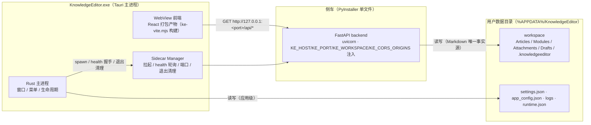
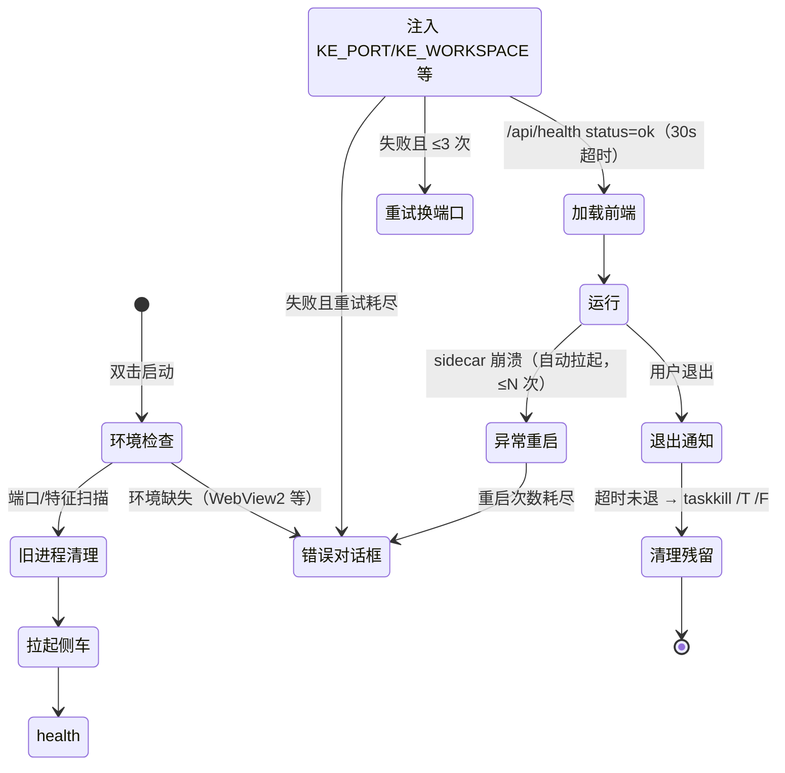

# Phase 7 桌面化实施规划（Tauri 集成、设置系统与发布）

> 阶段：7（实施规划） | 日期：2026-08-10 | 基线版本：v0.7.3（Phase 6U 完成态，冻结检查通过）
> 定位：Phase 7 总体蓝图，体例参考 `docs/phase0-architecture.html`；开工前准备基线见 `docs/phase7-prep.md`，闸门记录见 `docs/phase7-freeze-check-report.md`
> 范围：桌面化、系统集成、配置管理、发布。不重新实现 Phase 1-6 已交付的任何功能。
> 状态：决策点 D1-D7 已全部确认（2026-08-10，按默认方案），设计冻结，进入 M0 实施

## 目录

1. 阶段定位与边界
2. 技术选型与关键决策
3. 总体架构
4. 7.1 Tauri 集成
5. 7.2 Backend Sidecar 管理
6. 前端运行时适配（API base、CORS、端口）
7. 7.3 应用设置系统
8. 7.4 Workspace 桌面适配
9. 7.5 桌面系统集成
10. 7.6 用户数据与迁移
11. 7.7 构建与安装包
12. 7.8 发布前完整回归
13. 风险分析与应对
14. 分阶段实施计划（里程碑）
15. 待确认决策点
- 附录 A　版本策略
- 附录 B　目录结构总览

---

## 第 1 章　阶段定位与边界

Phase 7 把 KnowledgeEditor 从「浏览器 + 双进程开发环境」交付为「双击即用的 Windows 桌面软件」：Tauri 提供窗口与外壳，现有 React 前端作为打包资源加载，FastAPI 后端以侧车进程由 Tauri 管理，新增应用级设置系统，最终产出安装包。完成标准是用户机器上不需要 Python、Node、Rust 任何开发环境。

本阶段只做四件事：桌面化、系统集成、配置管理、发布。以下能力已在 Phase 1-6 完成并冻结，**禁止重新实现**：

| 禁止项 | 冻结依据 |
| --- | --- |
| Markdown 编辑器核心（Tiptap/ProseMirror、往返转换） | Phase 2-3 |
| 文件树与文档管理 | Phase 4 |
| Workspace 创建/打开逻辑 | Phase 4 |
| 模块系统 | Phase 5 |
| 搜索系统（FTS） | Phase 6 |
| 导入导出、自动保存、历史版本、崩溃恢复 | Phase 6 |
| Markdown 格式与编辑器 schema | 6E 冻结契约（信息块包裹格式、ke_version=1） |
| 后端 API | 6E 冻结的 42 端点基线；冻结检查确认仅 1 处增量扩展（`DELETE /api/attachments/{rel_path}`），Phase 7 不再新增或修改 |

与既有文档的关系：`docs/phase7-prep.md` 给出四类准备（环境、代码、工程、数据）与 6 步执行顺序，本文档在此基础上展开为完整蓝图；`docs/phase7-freeze-check-report.md` 是开工闸门记录，已判定「冻结与稳定性检查通过，Phase 7 可以开工」。

## 第 2 章　技术选型与关键决策

| 项 | 选择 | 理由与依据 |
| --- | --- | --- |
| 桌面框架 | Tauri 2（`@tauri-apps/cli` v2，Rust 主进程 + WebView2） | 体积小、内存占用低；官方文档明确支持 PyInstaller 打包的 Python 服务作为侧车 |
| 侧车 | PyInstaller 单文件 `knowledgeeditor-backend.exe`，经 `bundle.externalBin` 嵌入 | Phase 0 已确认的 A1 方案；`tauri-plugin-shell` 提供拉起与生命周期控制 |
| 安装包 | NSIS（exe 安装程序），`installMode: currentUser`（免提权、安装时用户可自选目录），MSI（WiX）为备选 | 两者在 `tauri build` 时需下载对应工具链，国内网络下 NSIS/WiX 下载失败是高频踩坑点；`currentUser` 模式免管理员且默认目录可改 |
| 端口策略 | 动态端口：Rust 预选空闲端口注入 `KE_PORT`，失败自动换端口重试 | 延续 Phase 0「端口被占用时自动换用下一个空闲端口」的既定设计 |
| 前端 API 基址 | 运行时注入 `window.__KE_API_BASE__`，dev 模式回退相对路径 | 兼容现有 Vite 代理开发流程与全部既有测试 |
| 应用设置存储 | `%APPDATA%\KnowledgeEditor\settings.json`（app 层，`KE_APP_CONFIG` 已支持覆盖） | 与「设置属于应用层、禁止混入 workspace 数据」原则一致 |
| 数据目录 | `%APPDATA%\KnowledgeEditor\workspace`（默认，经 `KE_WORKSPACE` 注入） | 安装目录只放程序，卸载不触碰用户数据 |

关键决策共 7 项（D1-D7），默认方案见第 15 章，确认后冻结。

## 第 3 章　总体架构



运行时架构与 Web 版保持同构：前端依然不直接访问文件，一切文件/搜索/历史操作经 FastAPI API；Markdown 仍是唯一事实源，SQLite 索引可整体重建。变化点只有两个——前端宿主从 Vite dev server 变为 Tauri WebView，后端宿主从手工启动的 venv 进程变为 Tauri 管理的侧车。

生命周期状态机：



## 第 4 章　7.1 Tauri 集成

在仓库根新建 `desktop/` 工程（Tauri v2 官方模板裁剪），结构与 `phase7-prep.md` 1.2 一致：

```
desktop/
  src-tauri/
    tauri.conf.json        # productName、frontendDist、externalBin、bundle 配置
    Cargo.toml
    src/                   # main.rs / lib.rs：窗口、菜单、侧车管理、命令
    binaries/              # knowledgeeditor-backend-x86_64-pc-windows-msvc.exe（侧车）
    capabilities/default.json   # shell:allow-execute/spawn 权限
    icons/                 # 应用图标（由 7.5 的图标源生成全套）
  scripts/                 # tauri dev / build 封装（走 ESBUILD_BINARY_PATH）
```

集成要点：

- **前端产物接入**：`frontendDist` 指向 `frontend/dist`（`npm run build` 经 `ke-vite.mjs` 产出，JS 约 1.94 MB / CSS 约 73.65 KB）。打包机必须继承 esbuild 改名副本约束（`.esbuild/esbuild-renamed.exe` + `ESBUILD_BINARY_PATH`），否则构建被本机安全软件拦截。
- **资源路径**：`tauri://localhost` 协议下不存在 Vite 代理，`client.ts` 的相对 `/api` 请求一律改为运行时基址拼接（第 6 章），图片/附件等静态资源沿用 `attachmentUrl` 后端转发的现有路径，不做前端直读文件。
- **dev 模式**：`tauri dev` 期间前端仍走 Vite dev server（保留代理），便于桌面端调试与既有 e2e 复用；两套模式只差 API 基址探测逻辑。

验收标准：桌面窗口启动后 UI 正常显示、编辑器正常加载、文件树/模块/搜索/导入导出等全部已有功能可访问；dev 与 release 两种模式各跑一遍浏览器端核心路径抽测（7 项）。

## 第 5 章　7.2 Backend Sidecar 管理

**禁止复制一套新的启动逻辑**。Sidecar Manager 直接复用现有三件资产：

| 复用资产 | 现状 | 桌面版用法 |
| --- | --- | --- |
| `/api/health` | 返回 `status/version/started_at`，`start.ps1` 已用它做握手 | 启动握手与版本校验的唯一依据，不新增接口 |
| runtime.json 记录设计 | `workspace/.knowledgeeditor/runtime.json`（backend/frontend 的 pid、port、started_at、version） | 记录 schema 原样保留，落盘位置改为应用数据目录（`%APPDATA%\KnowledgeEditor\runtime\runtime.json`） |
| `start.ps1` 四段式流程 | 环境检查 → 旧进程清理 → 启动 + health 握手 → 写记录 | Rust 端按同一顺序实现，dev 模式仍走 `start.ps1` 原脚本 |
| `stop.ps1` 兜底匹配 | 端口 + 命令行特征（`uvicorn app.main:app`）识别遗留进程并整树停止 | 桌面版退出清理沿用同思路：先通知、再等 5s、超时按 PID 树 `taskkill /T /F` |

启动流程：Tauri 拉起侧车（`app.shell().sidecar("knowledgeeditor-backend")`，注入 `KE_HOST=127.0.0.1`、`KE_PORT=<动态>`、`KE_WORKSPACE`、`KE_CORS_ORIGINS`），按 `start.ps1` 的握手节奏轮询 `/api/health`（每 1 秒、总超时 30 秒），`status=ok` 后把实际端口经前端基址注入再加载主界面。退出流程：用户关闭窗口 → 通知 backend（发送终止信号，uvicorn 正常收尾）→ 5 秒内未退则按 PID 树强制清理 → 删除 runtime.json。

异常处理：

| 异常 | 处理 | 用户可见提示 |
| --- | --- | --- |
| 侧车启动失败（进程立即退出） | 读取侧车 stderr 后 30 行，中止加载 | 错误对话框：失败原因 + 日志文件路径 |
| 端口占用 | 换下一个空闲端口重试，最多 3 次 | 仅日志记录，无打扰 |
| PID 残留（上次异常退出） | 启动前扫描 `runtime.json` + 端口/特征，先清理再拉起 | 无（自动恢复） |
| 侧车运行中崩溃 | 自动拉起并重试 health，≤3 次；仍失败才提示 | 错误对话框 + 恢复点提示（沿用现有崩溃恢复机制） |

新增物只有一处：`backend/run.py` 作为 PyInstaller 打包入口（程序化调用 `uvicorn.run`，读取 `KE_*` 环境变量）。它不触碰任何路由与 API，不属于「修改后端 API」的禁止范围。

## 第 6 章　前端运行时适配（API base、CORS、端口）

桌面化对前端代码的改动收敛到三处，其余 UI 与逻辑零改动：

1. **API 基址**：Rust 暴露 `get_runtime_info` 命令（返回 `apiBase`、`workspace`、`version`），前端在挂载前调用并写入 `window.__KE_API_BASE__`；`client.ts` 的 `request()`、`uploadAttachment`、`exportPackage` 等所有请求统一拼接基址。检测顺序：注入值 → dev 环境回退相对路径（Vite 代理）→ 无值时报配置错误。现有 vitest 单测因回退逻辑保持相对路径，不受影响。
2. **CORS**：侧车注入 `KE_CORS_ORIGINS`，在默认值后追加 `http://tauri.localhost`；`config.py` 默认值不变，Web 开发模式行为不变。
3. **P9 收敛**：`ke.ts` 与 `client.ts` 两份 `attachmentUrl` 在本次基址改造中一并合并到 `client.ts`（URI 编码行为以 `client.ts` 为准），删除 `ke.ts` 副本。

同批完成 Phase 6E 遗留的工程项（P10）：`package.json` 补 `test` 脚本（`vitest run`）并接入 `.github/workflows/ci.yml` 前端 job；CI 增加 OpenAPI 端点快照断言，防止侧车打包过程误动 API。

## 第 7 章　7.3 应用设置系统

**原则：设置属于应用层**。设置文件不写入 Markdown、不修改 Workspace 文件结构、不与文章数据混存。存储位置为 `%APPDATA%\KnowledgeEditor\settings.json`（应用配置目录，`KE_APP_CONFIG` 已支持环境变量覆盖，便于测试与迁移）。

schema（v1，`settings.json`）：

```json
{
  "schemaVersion": 1,
  "startup": {
    "restoreLastState": true,
    "autoOpenRecentWorkspace": true
  },
  "editor": {
    "autosaveIntervalMs": 3000,
    "historyRetentionCount": 30,
    "display": {}
  },
  "ui": {
    "theme": "system",
    "displayPreference": {}
  },
  "maintenance": {}
}
```

设置项与现有实现参数的映射：

| 分组 | 设置项 | 对接点（现有实现） |
| --- | --- | --- |
| 启动 | 恢复上次状态（重开上次文档/侧栏布局） | 前端 `localStorage` 状态 + 后端最近列表（`app_config.json`） |
| 启动 | 自动打开最近 Workspace | `app_config.json` 最近列表 + `KE_WORKSPACE` 注入 |
| 编辑器 | 自动保存间隔 | 前端 `EditorArea.tsx` 自动保存防抖常量（当前约 3s，迁移期保持默认值） |
| 编辑器 | 历史版本保留数量 | 后端备份策略（当前每文档 30 份 `Drafts/backup`，冻结检查确认） |
| 编辑器 | 显示选项（行号/软换行等编辑器外观项） | 编辑器扩展层，设置驱动，默认关闭以保持 UI 冻结 |
| 界面 | 深色/浅色模式 | 前端主题切换（`system`/`light`/`dark`） |
| 维护 | 查看日志 | 打开 `%APPDATA%\KnowledgeEditor\logs\`（沿用 `backend.log` / `backend.err.log` 命名） |
| 维护 | 打开数据目录 | 打开 `%APPDATA%\KnowledgeEditor\workspace` |
| 维护 | 重建索引入口 | 已有 `POST /api/index/rebuild`，仅加设置页入口，不新增后端接口 |

前端新增「设置」面板（抽屉或对话框），读写经 Rust 命令（`get_settings` / `update_settings`）落到 `settings.json`；设置变更即时生效，无需重启。**本阶段明确不实现**：插件系统、自定义主题编辑器、快捷键编辑器、AI 设置。

## 第 8 章　7.4 Workspace 桌面适配

Workspace 的创建、打开、文件树、文档管理在 Phase 4 已冻结，本阶段只补桌面交互入口：

- **系统目录选择器**：接入 `tauri-plugin-dialog`，首次启动引导与「打开 Workspace」使用原生目录选择；选定路径经 `KE_WORKSPACE` 注入后端，后端 `config.py` 已支持，无需改逻辑。
- **桌面路径兼容**：现有后端全程使用 workspace 相对路径与 `Path` 处理，`%APPDATA%` 长路径在 Windows 下无兼容问题；需回归验证的仅路径含空格/中文目录的情况。

验收：把开发机上的现有 workspace 复制到用户数据目录，确认文档、附件、模块、搜索、历史版本五项全部正常（对应 `phase7-prep.md` 4 的迁移测试关注点：冷启动、旧格式信息块兼容、FTS 索引重建）。

## 第 9 章　7.5 桌面系统集成

| 项 | 方案 |
| --- | --- |
| 应用名称 | KnowledgeEditor（`productName`，安装与卸载一致） |
| 应用图标 | 生成全套 `icons/`（32/128/256/ico），与现有徽标风格统一 |
| 窗口配置 | 默认 1440×900，最小 1000×640（保证三栏布局可用），居中启动 |
| 菜单 | 文件（新建/打开 Workspace/最近/退出）、编辑（标准操作）、视图（重载、dev 模式 DevTools 入口）、帮助（关于：版本来自三同步常量） |
| 文件关联（.md） | **v1.0.0 不做**（决策点 D6）：涉及外部文件导入 workspace 的语义与安全性，列为 v1.1 候选 |

窗口与菜单只影响外壳，不触碰任何数据结构；`tauri.conf.json` 的窗口配置与 `capabilities` 权限保持最小集。

## 第 10 章　7.6 用户数据与迁移

数据归属明确分开：

| 类别 | 内容 | 位置 | 管理方 |
| --- | --- | --- | --- |
| 应用数据 | `settings.json`、日志、`runtime.json`、跨 workspace 最近列表（`app_config.json`） | `%APPDATA%\KnowledgeEditor\` | 应用（可随卸载清理，属可再生成数据） |
| Workspace 数据 | `Articles/`、`Modules/`、`Attachments/`、`Drafts/`、`.knowledgeeditor/{index.db,settings.json}` | `%APPDATA%\KnowledgeEditor\workspace\` | 用户（Markdown 唯一事实源，安装/卸载均不触碰） |

- **安装程序约束**：NSIS 安装目录只放程序本体；workspace 默认落在用户数据目录；卸载程序不删除用户数据。Tauri NSIS 卸载器自带可勾选的「删除应用数据」复选框（默认不勾选），其指向 `%APPDATA%\KnowledgeEditor`——卸载确认文案显式说明：勾选仅删除设置与日志，workspace 始终保留；必要时用 NSIS hook 将 `workspace` 从清理范围剔除，双重保险。
- **首次启动引导**：两选项——「使用已有 Workspace」（目录选择器）或「创建新 Workspace」（在默认数据目录建标准结构并全量扫描建索引）。
- **迁移**：沿用 Phase 6E.2 已验证的搬迁路径（复制 → 校验 → 切 `KE_WORKSPACE`）；若检测到旧版 `~/.knowledgeeditor/app_config.json`（当前 Web 版位置），自动并入应用数据目录并保留最近列表。迁移全程不动源数据，只复制。

## 第 11 章　7.7 构建与安装包

构建链路（每步独立可验证）：

1. **前端**：`npm run build`（`tsc -b` + `ke-vite.mjs`，ESBUILD_BINARY_PATH 副本），产物 `frontend/dist`。
2. **侧车**：PyInstaller 单文件 `knowledgeeditor-backend.exe`（入口 `backend/run.py`；收集 `uvicorn` 隐藏导入 `uvicorn.logging`、`uvicorn.loops.auto`、`uvicorn.protocols.*`；`--paths backend` 保证 `app` 包可导入）。打包后在干净环境实测一次健康检查 + workspace 读写，不能以打包成功为准。
3. **重命名**：按 Tauri 要求带 target triple 后缀放入 `desktop/src-tauri/binaries/knowledgeeditor-backend-x86_64-pc-windows-msvc.exe`（`rustc --print host-tuple` 获取）。
4. **tauri build**：`bundle.targets` 限定 `["nsis"]`，`bundle.windows.nsis.installMode` 设为 `currentUser`（免提权，安装时用户仍可自选目录）；`productVersion` 与版本三同步对齐（v1.0.0）；Windows version info 填应用名/公司/描述。

安装包产物：`KnowledgeEditor_Setup.exe`（NSIS，含开始菜单快捷方式、卸载入口、可选便携解压说明）；MSI 作为备选在决策点 D2 确认。已知工程风险预置预案：NSIS/WiX 工具链在 `tauri build` 时联网下载，国内网络易超时——失败时下载离线包放入缓存目录重试，或临时改 `targets` 规避（见第 13 章 R4）。

新环境验收（按需求 7.7 的 7 步清单，在无开发环境的干净 Windows 上执行）：

1. 新环境安装 → 2. 首次启动（引导页） → 3. 打开已有 Workspace → 4. 编辑并保存文档 → 5. 关闭程序 → 6. 再次启动 → 7. 数据恢复正常（文档/索引/最近列表完整）。

## 第 12 章　7.8 发布前完整回归

综合测试文档 `docs/phase7-regression-test.md`（发布前创建），内容覆盖需求列出的全部类型：普通 Markdown、标题、列表、表格、数学公式、信息块（含旧自闭合格式兼容）、Footnote（两种样式）、Module、图片附件。

回归矩阵（每条在桌面 release 版实测）：

| 场景 | 验证点 |
| --- | --- |
| 冷启动 | 首启引导 → 主界面加载 → 文件树/搜索可用 |
| 保存读取 | 编辑 → 保存 → 重开内容一致（往返 golden 断言） |
| 导入导出 | 导出包 → 新 workspace 导入 → 附件与模块完整 |
| 搜索 | FTS 命中、索引重建入口可用 |
| 自动保存 | 间隔内自动落盘、防抖行为正常 |
| 历史版本恢复 | 备份生成、恢复点可用 |
| 异常退出恢复 | 强制终止进程 → 重启 → 恢复点提示与恢复 |

分层执行：pytest（102）+ vitest（62）+ `npm run build` 作为基线门槛；浏览器核心路径抽测（7 项）在 dev 模式复用；桌面冒烟清单在 release 安装版执行。全部通过后提升版本至 v1.0.0 并发布。

## 第 13 章　风险分析与应对

| 编号 | 风险 | 级别 | 应对 |
| --- | --- | --- | --- |
| R1 | Rust 工具链缺失（本机无 rustc/cargo 与 VS Build Tools） | 高（阻塞） | 安装 rustup stable + VS Build Tools；验收标准是空 Tauri 项目本机编译通过，而非仅安装成功 |
| R2 | PyInstaller 单文件体积大（40-70 MB）且易被杀软误报 | 高 | 精简依赖；打包后真实运行验证；误报时切换 onedir 目录模式（副作用：侧车多文件） |
| R3 | uvicorn/FastAPI 隐藏导入导致侧车运行即崩 | 高 | hidden imports 显式收集；打包后 health 握手 + workspace 读写实测 |
| R4 | `tauri build` 时 NSIS/WiX 工具链下载失败（国内网络高频踩坑） | 中高 | `targets` 限定 NSIS；离线包预置重试；文档记录排障路径 |
| R5 | 动态端口与多实例冲突 | 中 | Rust 预选空闲端口 + 3 次重试；runtime.json 记录清理；启动前端口/特征扫描 |
| R6 | API base/CORS 适配破坏 Web 开发流程 | 中 | 双模式：注入缺失时回退相对路径；vitest 全量回归；浏览器抽测双模式各跑一遍 |
| R7 | 安装程序误覆盖/误删用户数据 | 中 | 安装目录与数据目录分离；卸载脚本排除用户数据；干净环境 7 步验收覆盖 |
| R8 | 老系统缺 WebView2 Runtime | 低中 | 启动前检测，缺失时给出官方安装指引链接（Windows 10/11 一般自带） |
| R9 | 桌面 e2e 自动化成本（WebView 无标准 DevTools 协议） | 低 | dev 模式浏览器抽测为主，release 冒烟用人工清单（7.8），不投入 tauri-driver 全自动 |
| R10 | 首启引导/设置面板交互返工 | 低 | 引导限两选项，设置限四组默认值，UI 冻结于 Phase 2 视觉体系 |

## 第 14 章　分阶段实施计划（里程碑）

执行顺序与 `phase7-prep.md` 第 5 章的 6 步一致，展开为里程碑；每步完成时同步更新 `PROJECT_STATE.md` 与 `CHANGELOG_DEV.md`（记录修改内容、原因、影响范围、验证结果）。

| 里程碑 | 范围（对应节） | 交付物 | 验收标准 |
| --- | --- | --- | --- |
| M0 环境与脚手架 | R1；`desktop/` 工程（4） | Rust 工具链就绪；空 Tauri 工程编译通过；最小窗口加载 `frontend/dist` | `cargo build` 成功；窗口显示 UI |
| M1 侧车 | 5 | `backend/run.py`；PyInstaller 产物；Sidecar Manager（拉起/health/端口/退出清理） | 干净环境拉起侧车，health 30s 内 ok；退出后无残留进程 |
| M2 前端适配 | 6 | `get_runtime_info` 命令；`client.ts` 基址改造；CORS 注入；P9 合并；test 脚本 + CI | dev 与 release 双模式 7 项抽测通过；vitest 62/62；CI 含 OpenAPI 快照 |
| M3 设置系统 | 7 | `settings.json` schema；设置面板；Rust 读写命令 | 四组设置读写生效；维护项正确打开日志/数据目录/重建索引 |
| M4 Workspace 适配与迁移 | 8、10 | 系统目录选择器；首启引导；迁移脚本 | 复制 workspace 后文档/附件/模块/搜索/历史五项正常；卸载不清数据 |
| M5 桌面集成 | 9 | 图标、窗口、菜单、版本信息 | **已完成（2026-08-10）**：图标/窗口/菜单符合 7.5 表；dev 模式 DevTools 可用（详见 `PROJECT_STATE.md` M5 记录与 `CHANGELOG_DEV.md`） |
| M6 构建安装包 | 11 | NSIS 安装包 + 卸载支持 | **已完成（2026-08-11）**：干净环境 7 步验收全过 + 卸载验证数据保留（详见 `PROJECT_STATE.md` M6 记录与 `CHANGELOG_DEV.md`） |
| M7 回归与发布 | 12 | 综合回归文档与执行记录；v1.0.0 发布 | 回归矩阵全绿；版本三同步一致 |

最终交付报告（对应需求「最终输出」8 项，落盘 `docs/phase7-report.md`）：1 Tauri 集成情况、2 Sidecar 管理方案、3 设置系统说明、4 数据目录结构、5 构建方式、6 安装测试结果、7 已知限制、8 下一步维护建议。

## 第 15 章　待确认决策点

除 D1（Phase 0 已确认）外，D2-D7 六项已全部按默认方案确认（2026-08-10），设计冻结，实施中不再变更。

| 决策点 | 冻结方案（默认） | 备选（已否决） |
| --- | --- | --- |
| D1 侧车形态 | PyInstaller 单文件（Phase 0 A1 已确认） | Rust 原生重写（A2 预案，仅当侧车问题不可解时启用） |
| D2 安装包类型 | 仅 NSIS（`targets: ["nsis"]`、`installMode: currentUser`） | MSI（WiX）；两者都出则体积与 CI 时间翻倍 |
| D3 动态端口 | Rust 预选空闲端口 + 3 次重试 | 固定 8000（冲突面大，不推荐） |
| D4 应用设置位置 | `%APPDATA%\KnowledgeEditor\settings.json` | 沿用 `~/.knowledgeeditor/app_config.json`（不推荐，分散） |
| D5 默认 workspace | `%APPDATA%\KnowledgeEditor\workspace` | 安装目录内（卸载即丢数据，违反 7.6） |
| D6 .md 文件关联 | v1.0.0 不做 | v1.1 引入（需定义外部文件导入语义） |
| D7 发布版本 | v1.0.0（完成 Phase 7 时） | v0.9.x 预发布（仅当回归不满足门槛） |

## 附录 A　版本策略

进入 Phase 7 前确认当前版本：基线 v0.7.3（Phase 6U 完成态，冻结检查通过）。Phase 7 完成时发布 **v1.0.0**。整个阶段维持「版本三同步」：`backend/app/__init__.py` 唯一来源 + `frontend/src/version.ts` + `frontend/package.json`，`start.ps1` 对不一致给出警告；安装包 `productVersion` 与 Windows version info 从同一常量读取，避免第三处漂移。

## 附录 B　目录结构总览

```
安装目录（NSIS，仅程序本体）
  KnowledgeEditor.exe
  knowledgeeditor-backend-x86_64-pc-windows-msvc.exe   # 侧车（随主程序）
  resources/（前端打包产物）

用户数据目录 %APPDATA%\KnowledgeEditor\
  settings.json            # 7.3 应用设置（schemaVersion 1）
  app_config.json          # 跨 workspace 最近列表等（现有 APP_CONFIG 设计迁移至此）
  logs\                    # backend.log / backend.err.log（沿用现有命名）
  runtime\runtime.json     # 复用现有记录 schema（pid/port/started_at/version）
  workspace\               # KE_WORKSPACE 指向（用户数据，卸载不触碰）
    Articles\  Modules\  Attachments\  Drafts\
    .knowledgeeditor\      # index.db（FTS schema 2）、settings.json
```
